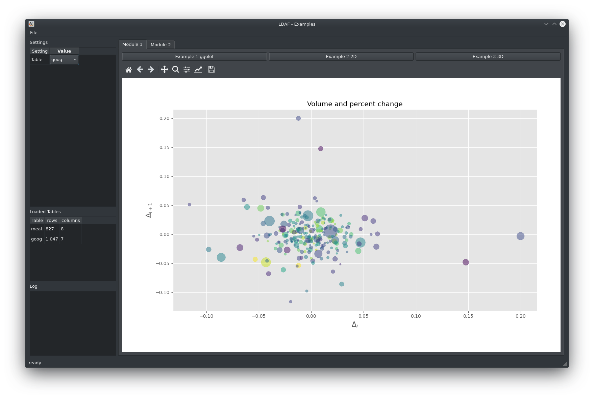

# LDAF - Large Data Analysis Framework

LDAF is a Python framework to support data scientists when working on large data sets.
In this case Large Data is defined as data, that can still fit into the RAM. 
Out of core processing may also be possible, but has not been tested.
Data sets with size up to 10GB have been successfully tested.

Exploring Data is often an iterative process which can be slowed down when loading the data on every iteration.
LDAF has been developed to solve this problem by separating the data from the analysis process.
Data can be loaded once and analysis modules can be loaded/updated dynamically during runtime. 

To visualise data, LDAF supports matplotlib and ggplot.
Figures are printed inside the matplotlib canvas with all its features, including the picker event.
In this way, interactive applications can be created with little effort.

Custom settings can be added to provide user input for the analysis.



> :warning: **This project is still in beta state and the API may change in future.**

> :warning: Any suggestions and comments are welcome.

## Functionality

* Load data
* Load/Reload analysis modules
* Custom settings
* View data and interact with the figure
* View data as table

## Example

Example analysis function:

```python
from ggplot import *

def example_1(app: 'App', fig=None):
    """Example taken from:
    http://ggplot.yhathq.com/

    """
    df = app.data_source.get_table('meat')

    g = ggplot(aes(x='date', y='beef'), data=df)
    g += geom_line()

    return g
```

For a full example application please see:
https://github.com/peckto/ldaf-example


## Workflow

To work with LDAF, the following workflow is recommended:

1) Load data `DataSource.py` (eg. from csv, hdf5, sql, ...)
2) Optional: Add custom settings `Settings.py`
3) Develop analysis module `Module_1.py`
4) Run module
5) go to 3 and repeat


## Usage

LDAF is designed as a library and cannot be run standalone.
It can be installed like any other python packet.
To start the application, at least the following abstract classes must be implemented:

* `ldaf.DataSource` Load the data set(s)
* `ldaf.Settings` Optional: Add custom settings

To run LDAF, the following main code snippet can be used:

```python
import sys
from PyQt5.QtWidgets import QApplication

from ldaf.App import App
from Settings import Settings
from DataSource import DataSource


if __name__ == "__main__":
    app = QApplication(sys.argv)
    data_source = DataSource()
    settings = Settings()
    modules_dir = 'Modules'
    window_title = 'LDAF - Examples'

    window = App(app, data_source, modules_dir, settings, window_title)
    window.show()

    sys.exit(app.exec_())

```

All analysis modules must be located in one folder. 
All python files inside the `modules_dir` are loaded as modules.
One module can have multiple analysis functions.

A sample module with one analysis function can look as follows:

```python
settings = {}
"Work in process"
actions = {}
"Work in process"

name = 'Module 2'
"Display name of module"
table = 'example2'
"is mapped to app.active_table, WIP"


def example_1(app: 'App', fig=None):
    table = app.settings.get('Table')

    df = app.data_source.get_table(table)
    df.name = '%s Data' % table
    "name attribute must be set"

    return df


functions = {
    'Example 1 Table': example_1,
}
```

## GUI

The GUI is based on PyQt5 and has been created with Qt Designer (`Main.ui`).

The GUI has the following main widgets:

Widget | Description
------ | ----
Menu (File) | Load data and reload modules
Settings | Custom settings to interact with the modules (`Settings.py`)
Loaded Tables | Shows statistics about loaded data sets
Log | Modules log messages
Statusbar | Shows information about running process
Analysis | The loaded modules are represented as tabs and the analysis functions can be called via the buttons

## Dependencies

The following python modules are necessary to run LDAF:

* numpy
* pandas
* PyQt5
* matplotlib
* ggplot @ git+git://github.com/peckto/ggpy

(See also `requirements.txt`)

A modified version of ggplot is necessary to plot inside specified canvas object.
To prevent incompatibilities, it is recommended to install LDAF inside a virtual env.
